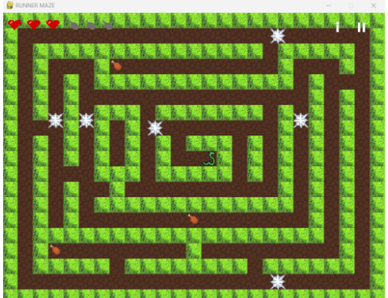
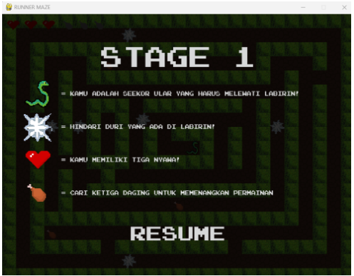
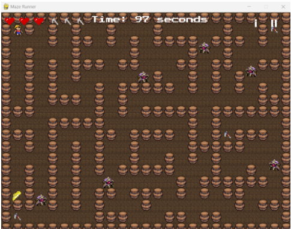
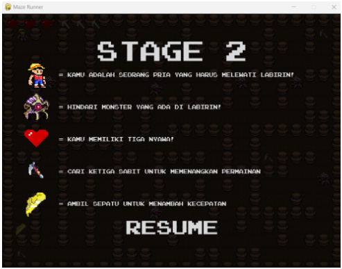
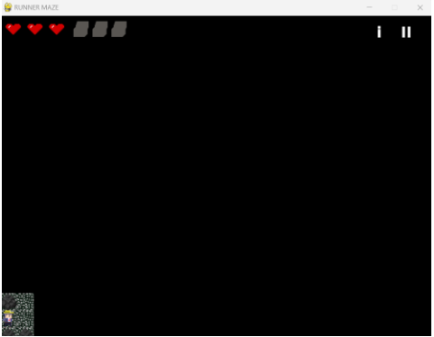
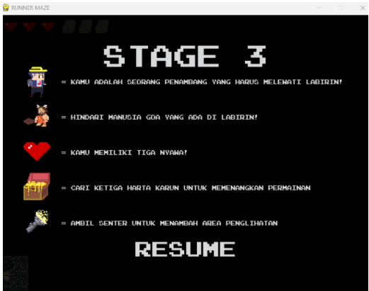

# 🧩 Maze Runner

Maze Runner adalah permainan labirin berbasis Python yang menantang pemain untuk menavigasi melalui berbagai tingkat labirin untuk mencapai tujuan akhir. Game ini dirancang untuk menguji keterampilan pemecahan masalah dan refleks pemain.

## 🚀 Fitur Utama

- 🎮 Beberapa tingkat labirin dengan tingkat kesulitan yang meningkat.
- ⏱️ Sistem timer untuk melacak waktu penyelesaian setiap tingkat.
- 🎵 Integrasi musik latar untuk meningkatkan pengalaman bermain.
- 🎨 Antarmuka grafis yang sederhana dan intuitif.

## 🛠️ Teknologi yang Digunakan

- **Python**: Bahasa pemrograman utama.
- **Pygame**: Library untuk pengembangan game 2D.
- **Font dan Musik**: Sumber daya tambahan untuk meningkatkan estetika dan pengalaman audio.

## 📂 Struktur Proyek
```
Maze_Runner/
├── pycache/
├── font/
├── image/
├── map/
├── music/
├── Menu.py
├── stage1.py
├── stage2.py
├── stage3.py
├── timer.py
└── README.md
```
## 📸 Tangkapan Layar

### Stage 1



### Stage 2



### Stage 2




## 🔧 Cara Menjalankan

1. Pastikan Python dan Pygame telah terinstal di sistem Anda.
2. Clone repositori ini ke komputer Anda:
   ```
   git clone https://github.com/KennAustin/Maze_Runner.git
   ```
3. Navigasi ke direktori proyek:
   ```
   cd Maze_Runner
   ```
4. Jalankan permainan:
   ```
   python Menu.py
   ```

## 📌 Catatan

- Pastikan semua direktori seperti `font/`, `image/`, `map/`, dan `music/` berada di lokasi yang benar agar game berjalan dengan lancar.
- Jika mengalami masalah dengan font atau musik, periksa kembali path dan format file yang digunakan.
